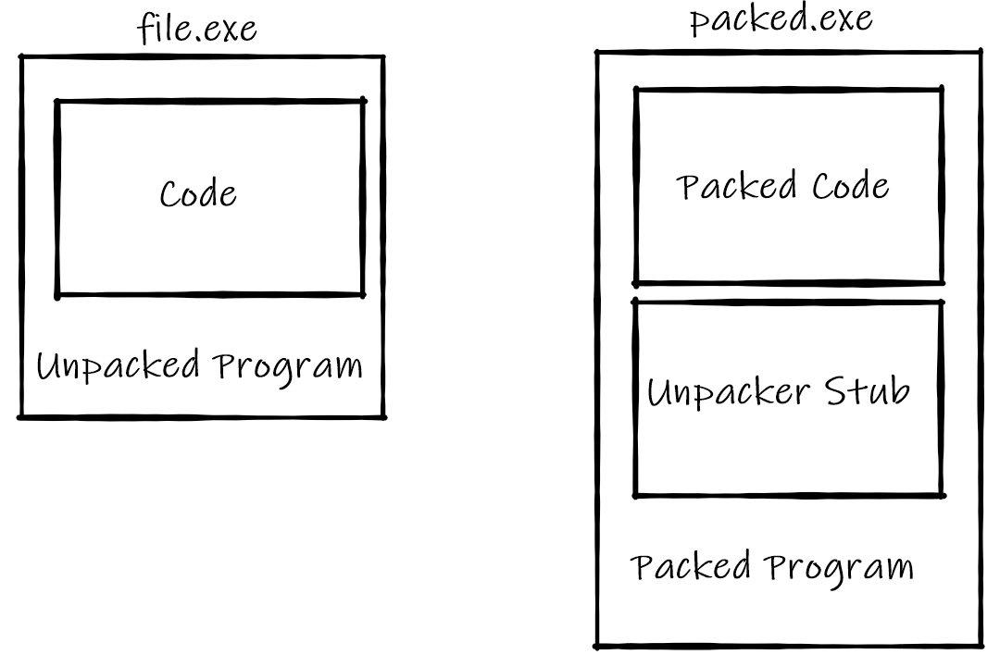

# <!-- fit --> Code Protection
by not-matthias

---

### Nothing is 100% secure. 

It's just a matter of time.

---

### Agenda

- Obfuscation
- Anti Debugging
- Packing 

---

## Obfuscation

> To make something so confused or opaque as to be difficult to perceive or understand.

---

### Unobfuscated JavaScript

```javascript
console.log("Hello World!");
```

--- 

### Obfuscated JavaScript

```javascript
var _0x21a2 = ['log', 'Hello\x20World!'];
var _0x3255 =
    (_0x26e26d, _0x591f48) => {
        _0x26e26d = _0x26e26d - 0x0; 
        var _0x288482 = _0x21a2[_0x26e26d];
        return _0x288482;
    };
console[_0x3255('0x0')](_0x3255('0x1'));
```

--- 

### Pros

- Reduced file size (when minified)
- Very confusing and hard to deal with
- Will stop a large portion of people

---

### Cons

- Performance
- Will not prevent reversing
- Only useful for script languages TODO
- Revertable with a script

---

## Anti Debugging

- Detecting the debugger
- Restricting/Limiting debugger usage

---

### Example

```javascript
while(true) {
    debugger;
}
```

---

### Pros

- It takes time to remove it
- It's hard to reverse without a debugger

---

### Cons

- Performance
- Only good when combined

---

## Packing

Encrypting the binary

--- 

### Concept



---

### Pros

- Hard to extract the real binary
- Hard to remove 

---

### Cons

- Performance
- Increased file size

---

### Other Types

- Terms of service
- Virtualization
- Permutation
- ...

---

## When to use what?

It always depends on these factors:
- Money
- File Size
- Performance
- Programming Language
- ...

---

### Thanks for your attention.

---
---
---

## Virtualization

Emulating the code in a virtual processor.

---

### Pros

- Very hard to reverse

---

### Cons

- Performance
- Complicated to implement

---